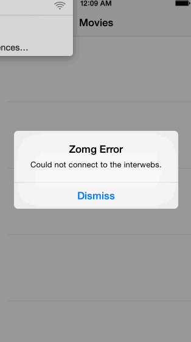

## Rotten Tomatoes

This is a movies app displaying box office and top rental DVDs using the [Rotten Tomatoes API](http://developer.rottentomatoes.com/docs/read/JSON).

Time spent: 5 hours

### Features

#### Required

- User can view a list of movies. Poster images load asynchronously.
- User can view movie details by tapping on a cell.
- User sees loading state while waiting for the API.
- User sees error message when there is a network error. 
- User can pull to refresh the movie list.

### Walkthrough

Credits
---------
* [Rotten Tomatoes API](http://developer.rottentomatoes.com/docs/read/JSON)
* [AFNetworking](https://github.com/AFNetworking/AFNetworking)
